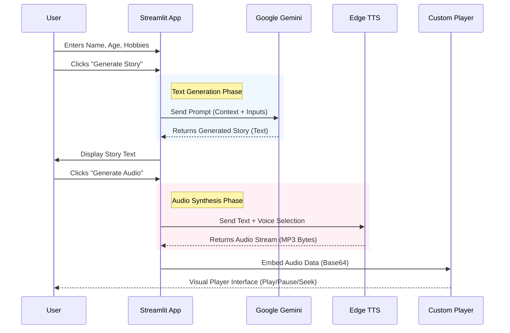

# Architecture Documentation - Fairy Tale Generator

## System Overview
The **Fairy Tale Generator** is a web-based application designed to create personalized bedtime stories for children. It leverages Generative AI (Google Gemini) to author unique content based on user inputs (name, age, hobbies) and converts the text into natural-sounding speech using Neural TTS (Edge TTS).

## Technology Stack
- **Frontend/Backend Framework**: [Streamlit](https://streamlit.io/) (Python)
- **AI Core**: [Google Gemini Pro/Flash](https://ai.google.dev/) (Text Generation)
- **Text-to-Speech**: [Edge TTS](https://github.com/rany2/edge-tts) (Neural Audio Synthesis)
- **Audio Player**: Custom HTML5/CSS3/JS Component (Embedded in Streamlit)
- **Deployment**: Local Python Environment (Expandable to Streamlit Cloud/Docker)

## Project Structure
```
Project Root
├── app.py                # Main Application Logic (UI + Backend)
├── requirements.txt      # Python Dependencies
├── .streamlit/           # Streamlit Configuration
│   └── secrets.toml      # API Keys (Local development)
├── app.log               # Application Runtime Logs
└── ARCHITECTURE.md       # This Document
```

## Data Flow
The application follows a linear, stateless data flow:



## Key Components

### 1. `app.py` (The Monolith)
The entire application logic is contained within a single file for simplicity and portability.
- **UI Render**: Uses standard Streamlit widgets (`st.text_input`, `st.button`).
- **State Management**: Uses `st.session_state` to persist the generated story and audio between interacting re-runs.
- **Custom Player**: A `display_audio_player` function injects a modern, responsive HTML audio player using `st.components.v1.html`. This bypasses Streamlit's native player limitations.

### 2. Logging
Built-in Python `logging` tracks critical events:
- Application startup.
- API Configuration status.
- Generation start/success/failure.
- TTS performance metrics.
Logs are output to both `console` and `app.log`.
