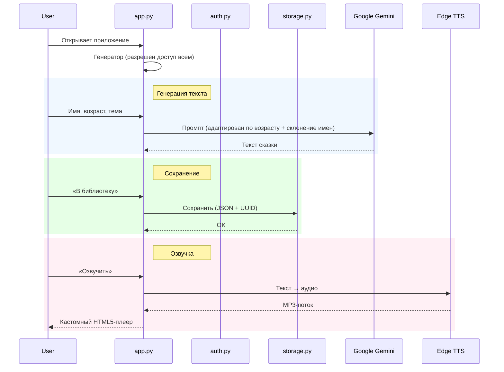

# Документация Архитектуры — Генератор Сказок

## Обзор Системы
**Генератор Сказок** — веб-приложение для генерации персонализированных сказок для детей. Использует Google Gemini для создания текста и Edge TTS для озвучки нейронными голосами.

## Технологический Стек
| Компонент | Технология |
|---|---|
| Frontend/Backend | [Streamlit](https://streamlit.io/) (Python 3.10+) |
| ИИ Ядро | [Google Gemini](https://ai.google.dev/) Flash/Pro |
| Синтез речи | [Edge TTS](https://github.com/rany2/edge-tts) |
| Аутентификация | [Supabase Auth](https://supabase.com/) |
| Аудио Плеер | Кастомный HTML5/CSS3/JS |
| Развёртывание | Локально / Streamlit Cloud / Docker |

## Структура Проекта
```
fairy_tale_generator/
├── app.py                # Точка входа: роутинг, генератор, плеер
├── auth.py               # Авторизация (Supabase)
├── storage.py            # Уровень хранения (Local JSON / Будущий Supabase)
├── landing.py            # Лендинг-страница (временно отключён)
├── styles.py             # Глобальные CSS-стили
├── utils.py              # Утилиты (валюта, форматирование)
├── requirements.txt      # Зависимости Python
├── .streamlit/
│   └── secrets.toml      # API-ключи (НЕ в git)
├── stories.json          # Локальная база данных сохраненных сказок
├── DEV_LOG.md            # Журнал разработки (обратная хронология)
├── README.md             # Документация проекта
├── ROADMAP.md            # План развития и тарифы
└── ARCHITECTURE.md       # Этот документ
```

## Поток Данных



## Ключевые Компоненты

### 1. `app.py` (Оркестратор)
Главный файл (~840 строк). Управляет всем жизненным циклом:
- **Роутинг**: Настройка доступа и управление состоянием сессии.
- **Генерация**: Cascade-модель — перебор Gemini-моделей (`flash-lite` → `flash` → `pro`).
- **Prompt Engineering**: Продвинутая адаптация под возраст и **контекстное склонение имен героев**.
- **Плеер**: `display_audio_player()` — HTML5/JS компонент с поддержкой скорости и скачивания.
- **Интеграция**: Связывает `auth.py`, `storage.py` и `styles.py`.

### 2. `auth.py` (Безопасность)
Обёртка над Supabase Client:
- `sign_up()`, `sign_in()`, `sign_out()`, `is_authenticated()`
- Безопасный импорт: `_SUPABASE_AVAILABLE` — приложение работает и без Supabase.
- Хранение сессии в `st.session_state`.

### 3. `landing.py` (Маркетинг)
> ⚠️ **Временно отключён** (см. ROADMAP.md → Фаза 4).

Hybrid Rendering: HTML/CSS для визуалов + Streamlit для интерактива.
- Glassmorphism, mesh-градиенты, анимации
- Инкапсулированные стили через `inject_landing_styles()`
- Pricing, FAQ, Auth-формы

### 4. `styles.py` (Глобальный Дизайн)
CSS-стили для интерфейса генератора (авторизованные пользователи):
- **Premium UI**: Glassmorphisminputs, анимированные градиентные кнопки (Gradient Shift), кастомные Selectbox и Sliders.
- **Темы**: Полная поддержка Light/Dark режимов с адаптивными цветовыми палитрами.
- **Анимации**: Hover-эффекты, Pulse, Glow для интерактивных элементов.
- `inject_landing_styles()` — инъекция в Streamlit.

### 5. `utils.py` (Утилиты)
- `get_user_currency()` — определение валюты по IP (ipapi.co)
- `format_price()` — форматирование с разделителями тысяч
- Поддержка: RUB, USD, EUR, KZT, BYN, UZS

### 6. `storage.py` (Уровень данных)
Инкапсулирует логику работы с сохраненными историями:
- **Local Persistence**: Чтение/запись в `stories.json`.
- **CRUD**: Функции `save_story`, `load_stories`, `delete_story`.
- **Sort**: Автоматическая сортировка по дате создания (новые сверху).
- **ID**: Генерация UUID для каждой сохраненной записи.

### 7. Логирование
Python `logging` → `console` + `app.log`:
- Статус API-конфигурации
- Успех/ошибки генерации текста и аудио
- Проблемы авторизации

## Планируемые изменения
Подробный план: см. [ROADMAP.md](ROADMAP.md)
- Тарифы: Free / Pro (499₽) / Family (799₽)
- Профили детей, история сказок, мультиязычность
- Оплата: ЮKassa + Paddle + криптовалюты
