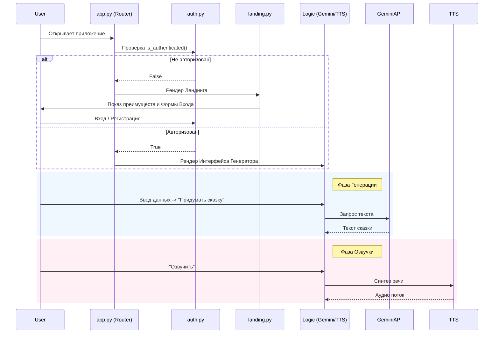

# Документация Архитектуры - Генератор Сказок

## Обзор Системы
**Генератор Сказок** — это веб-приложение, созданное для генерации персонализированных сказок на ночь для детей. Оно использует Generative AI (Google Gemini) для создания уникального контента на основе данных пользователя (имя, возраст, хобби) и преобразует текст в естественную речь с помощью Neural TTS (Edge TTS).

## Технологический Стек
- **Frontend/Backend Фреймворк**: [Streamlit](https://streamlit.io/) (Python)
- **ИИ Ядро**: [Google Gemini Pro/Flash](https://ai.google.dev/) (Генерация текста)
- **Синтез Речи**: [Edge TTS](https://github.com/rany2/edge-tts) (Нейронный синтез аудио)
- **Аудио Плеер**: Кастомный HTML5/CSS3/JS Компонент (Встроен в Streamlit)
- **Развертывание**: Локальное Python окружение (Масштабируемо до Streamlit Cloud/Docker)

## Структура Проекта
```
Корень Проекта
├── app.py                # Точка входа: Роутинг, UI Генератора, Плеер
├── auth.py               # Модуль авторизации (Supabase Integration)
├── landing.py            # UI Лендинга и маркетинговые компоненты
├── styles.py             # Централизованные CSS стили и темы
├── utils.py              # Утилиты (определение валюты, форматирование)
├── requirements.txt      # Зависимости Python
├── .streamlit/           # Конфигурация Streamlit
│   └── secrets.toml      # API ключи (Gemini + Supabase)
├── app.log               # Логи работы приложения
└── ARCHITECTURE.md       # Этот документ
```

## Поток Данных (Data Flow)
Приложение следует линейному, stateless потоку данных с проверкой сессии:



## Ключевые Компоненты

### 1. `app.py` (Оркестратор)
Главный файл, управляющий состоянием сессии (`st.session_state`) и маршрутизацией.
- **Роутинг**: Переключает отображение между `landing.py` и внутренним интерфейсом генератора.
- **Плеер**: Содержит функцию `display_audio_player` для рендеринга кастомного HTML5 плеера.
- **Логика генерации**: Взаимодействует с `google.generativeai` и `edge_tts`.

### 2. `auth.py` (Безопасность)
Обертка над Supabase Client.
- Реализует функции `sign_up`, `sign_in`, `sign_out`.
- Управляет сохранением пользователя в `st.session_state`.
- Изолирует работу с секретными ключами базы данных.

### 3. `landing.py` (Маркетинг)
Отвечает за "лицо" приложения.
- Содержит функции для рендера секций: Hero, Benefits, Pricing.
- Инкапсулирует верстку, специфичную для неавторизованных пользователей.

### 4. `styles.py` (Дизайн)
Хранилище CSS-стилей и тем.
- Определяет глобальные переменные цветов (`THEME_COLORS`).
- Содержит CSS для glassmorphism эффектов и анимаций (например, звездный фон).

### 5. Логирование
Встроенный Python `logging` отслеживает критические события:
- Статус конфигурации API.
- Успех/ошибка генерации текста и аудио.
- Проблемы с авторизацией.
Логи выводятся в `console` и файл `app.log`.
