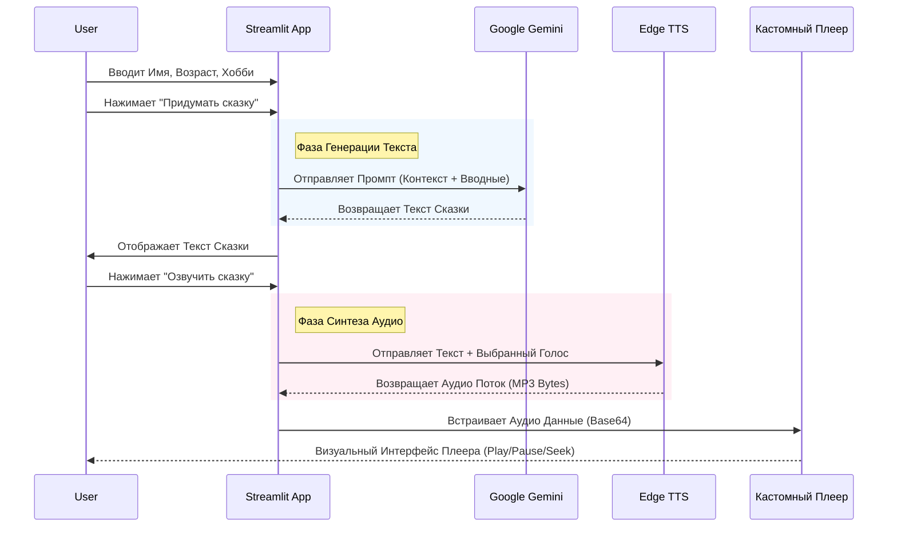

# Документация Архитектуры - Генератор Сказок

## Обзор Системы
**Генератор Сказок** — это веб-приложение, созданное для генерации персонализированных сказок на ночь для детей. Оно использует Generative AI (Google Gemini) для создания уникального контента на основе данных пользователя (имя, возраст, хобби) и преобразует текст в естественную речь с помощью Neural TTS (Edge TTS).

## Технологический Стек
- **Frontend/Backend Фреймворк**: [Streamlit](https://streamlit.io/) (Python)
- **ИИ Ядро**: [Google Gemini Pro/Flash](https://ai.google.dev/) (Генерация текста)
- **Синтез Речи**: [Edge TTS](https://github.com/rany2/edge-tts) (Нейронный синтез аудио)
- **Аудио Плеер**: Кастомный HTML5/CSS3/JS Компонент (Встроен в Streamlit)
- **Развертывание**: Локальное Python окружение (Масштабируемо до Streamlit Cloud/Docker)

## Структура Проекта
```
Корень Проекта
├── app.py                # Основная логика приложения (UI + Backend)
├── requirements.txt      # Зависимости Python
├── .streamlit/           # Конфигурация Streamlit
│   └── secrets.toml      # API ключи (Локальная разработка)
├── app.log               # Логи работы приложения
└── ARCHITECTURE.md       # Этот документ
```

## Поток Данных (Data Flow)
Приложение следует линейному, stateless потоку данных:



## Ключевые Компоненты

### 1. `app.py` (Монолит)
Вся логика приложения содержится в одном файле для простоты и переносимости.
- **Отрисовка UI**: Использует стандартные виджеты Streamlit (`st.text_input`, `st.button`).
- **Управление Состоянием**: Использует `st.session_state` для сохранения сгенерированной сказки и аудио между перезагрузками страницы.
- **Кастомный Плеер**: Функция `display_audio_player` внедряет современный, адаптивный HTML аудио плеер через `st.components.v1.html`. Это позволяет обойти ограничения стандартного плеера Streamlit.

### 2. Логирование
Встроенный Python `logging` отслеживает критические события:
- Запуск приложения.
- Статус конфигурации API.
- Старт/успех/ошибка генерации.
- Метрики производительности TTS.
Логи выводятся в `console` и файл `app.log`.
