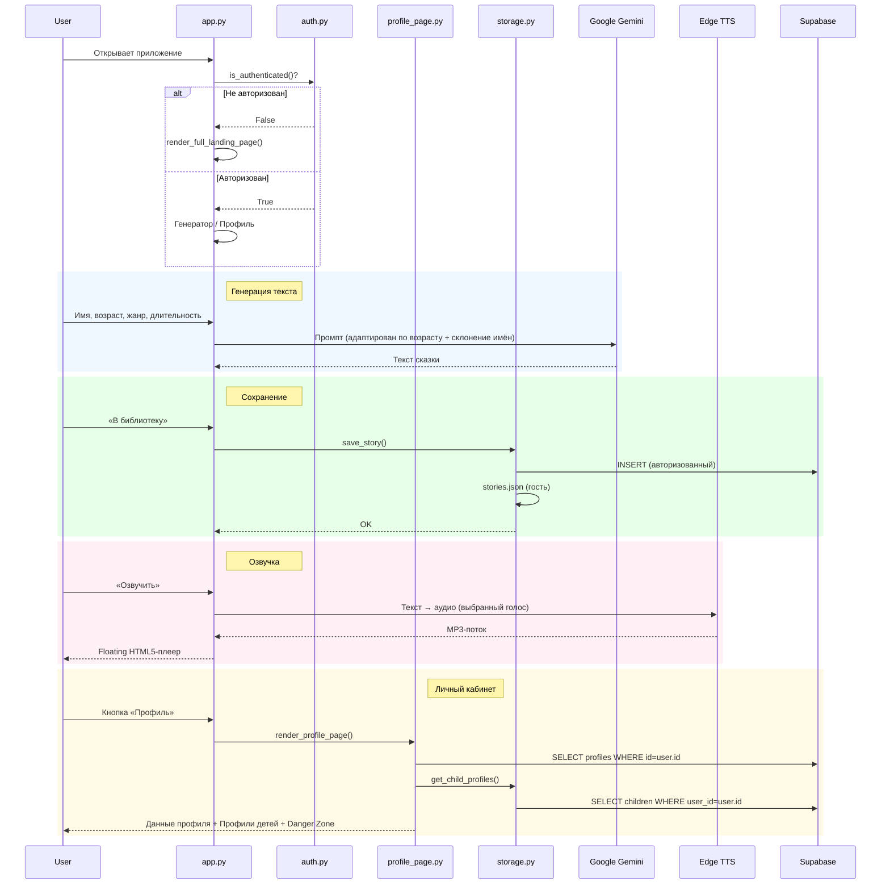

# Документация Архитектуры — Генератор Сказок
> Актуально на: 12.03.2026 | Версия: v3.8

## Обзор Системы
**Генератор Сказок** — веб-приложение для генерации персонализированных сказок для детей. Использует Google Gemini для создания текста и Edge TTS для озвучки нейронными голосами. В версии v3.8 внедрена улучшенная система синхронизации сессий, гарантирующая сохранение состояния авторизации при обновлении страницы (F5).

## Технологический Стек
| Компонент | Технология |
|---|---|
| Frontend/Backend | [Streamlit](https://streamlit.io/) (Python 3.10+) |
| ИИ Ядро | [Google Gemini](https://ai.google.dev/) Flash 2.0 Lite / Flash Latest |
| Синтез речи | [Edge TTS](https://github.com/rany2/edge-tts) (Microsoft Neural Voices) |
| Аутентификация | [Supabase Auth](https://supabase.com/) — Email + Google OAuth PKCE |
| Аудио Плеер | Кастомный HTML5/CSS3/JS (floating, синхронизация ) |
| Развёртывание | Локально / Streamlit Cloud / Docker |

## Структура Проекта
```
fairy_tale_generator/
├── app.py                # Точка входа: роутинг (early sync), генератор, сайдбар, плеер
├── landing.py            # Лендинг 3.0 (glassmorphism, scroll-анимации, auth sync)
├── profile_page.py       # Личный кабинет (профиль, история, профили детей, удаление аккаунта)
├── auth.py               # Авторизация (Supabase, PKCE Flow, Session Bounded)
├── config.py             # Централизованные константы: языки, голоса, модели
├── export.py             # Мультиформатный экспорт (TXT, PDF, EPUB, FB2, MP3)
├── i18n.py               # Переводы интерфейса генератора (8 языков + профили детей)
├── landing_i18n.py       # Переводы лендинга (8 языков)
├── legal.py              # Страницы Privacy Policy и Terms of Service
├── legal_i18n.py         # Переводы юридических документов (8 языков)
├── storage.py            # Хранилище (Supabase DB + Local JSON), CRUD для историй и профилей детей
├── styles.py             # Глобальные CSS-стили (dark/light темы)
├── utils.py              # Утилиты: валюта, язык, форматирование цен
├── requirements.txt      # Зависимости Python
├── .streamlit/
│   └── secrets.toml      # API-ключи (НЕ в git)
├── assets/               # Статические ресурсы (шрифты, изображения)
├── tests/                # Unit-тесты (pytest)
│   ├── test_config.py
│   ├── test_i18n.py
│   ├── test_storage.py
│   └── test_utils.py
├── stories.json          # Локальная БД сохранённых сказок (runtime, не в git)
├── DEV_LOG.md            # Журнал разработки (обратная хронология)
├── README.md             # Документация проекта
├── ROADMAP.md            # План развития
└── ARCHITECTURE.md       # Этот документ
```

## Поток Данных


```mermaid
sequenceDiagram
    participant User
    participant App as app.py
    participant Auth as auth.py
    participant Profile as profile_page.py
    participant Storage as storage.py
    participant Gemini as Google Gemini
    participant TTS as Edge TTS
    participant Supabase

    User->>App: Открывает приложение
    App->>Auth: is_authenticated()?
    alt Не авторизован
        Auth-->>App: False
        App->>App: render_full_landing_page()
    else Авторизован
        Auth-->>App: True
        App->>App: Генератор / Профиль
    end

    rect rgb(240, 248, 255)
        note right of App: Генерация текста
        User->>App: Имя, возраст, жанр, длительность
        App->>Gemini: Промпт (адаптирован по возрасту + склонение имён)
        Gemini-->>App: Текст сказки
    end

    rect rgb(230, 255, 230)
        note right of App: Сохранение
        User->>App: «В библиотеку»
        App->>Storage: save_story()
        Storage->>Supabase: INSERT (авторизованный)
        Storage->>Storage: stories.json (гость)
        Storage-->>App: OK
    end

    rect rgb(255, 240, 245)
        note right of App: Озвучка
        User->>App: «Озвучить»
        App->>TTS: Текст → аудио (выбранный голос)
        TTS-->>App: MP3-поток
        App-->>User: Floating HTML5-плеер
    end

    rect rgb(255, 250, 230)
        note right of Profile: Личный кабинет
        User->>App: Кнопка «Профиль»
        App->>Profile: render_profile_page()
        Profile->>Supabase: SELECT profiles WHERE id=user.id
        Profile->>Storage: get_child_profiles()
        Storage->>Supabase: SELECT children WHERE user_id=user.id
        Profile-->>User: Данные профиля + Профили детей + Danger Zone
    end
```

## Ключевые Компоненты

### 1. `app.py` (Оркестратор)
Главный файл (~1470 строк). Управляет всем жизненным циклом:
- **Роутинг**: `current_page` в `st.session_state` — `landing` / `generator` / `profile` / `privacy` / `terms`.
- **Генерация**: Cascade-модель — перебор Gemini-моделей (`flash-2.0-lite` → `flash-lite` → `flash`).
- **Prompt Engineering**: 6 возрастных групп (0-12м, 1-3г, 4-7л, 8-12л, 13-17л, 18+) + 12 жанров + контекстное склонение имён.
- **Длительность**: Выбор (1, 5, 15 мин), маппинг в кол-во слов через `STORY_LENGTH_MAP`.
- **Сайдбар**: Кнопка профиля (ghost, `type="tertiary"`) в верхней части; кнопка выхода (`type="secondary"`) — в самом низу.
- **Плеер**: `display_audio_player()` — HTML5/JS с поддержкой скорости, повтора, скачивания.
- **Выход**: После `sign_out()` явно устанавливает `current_page = 'landing'` перед `st.rerun()`.

### 2. `landing.py` (Маркетинг — Landing 3.0)
Полностью кастомный HTML/CSS/JS внутри Streamlit-контейнеров:
- Секции: Hero (типизирующие сниппеты), Stats, Features, How It Works, Examples, Testimonials, Pricing, Auth, FAQ, Footer.
- **Hero-карточки сниппетов**: Заголовки и badges вшиваются через Python (мгновенно), текст — JS typing-эффект.
- **Фиксированные размеры сниппетов**: `height: 7.5em` в CSS — карточки не прыгают при анимации.
- **Лендинг i18n**: полный перевод через `landing_i18n.py` + локальная функция `t(key)`.
- **Динамические тарифы**: Мультивалюта (RUB/EUR/USD) через API курсов валют, конвертация из RUB.

### 3. `profile_page.py` (Личный Кабинет)
- Получает данные из `auth.users` и `public.profiles` через Supabase.
- Отображает: email, дату регистрации (с количеством дней), тарифный план, дату последнего входа.
- **Danger Zone**: Удаление аккаунта с подтверждением словом на языке пользователя (УДАЛИТЬ / DELETE / ELIMINAR / SUPPRIMER / LÖSCHEN / EXCLUIR / 删除 / हटाएं).
- **Профили детей**: Управление списком детей (CRUD), данные которых используются для автозаполнения формы генерации.
- **Локализация**: Полный словарь `L` на 8 языков (ru/en/es/fr/de/pt/zh-CN/hi) для всех строк.

### 4. `auth.py` (Авторизация и Безопасность)
- **SessionBounded PKCE Flow**: Безопасная работа в многопользовательской среде Streamlit.
- **IsolatedDiskStorage**: Привязка сессий к Cookie `client_id` для авто-логина.
- Методы: `sign_up()`, `sign_in()`, `sign_out()`, `is_authenticated()`, `handle_oauth_callback()`, `delete_current_account()`.
- **Graceful fallback**: `_SUPABASE_AVAILABLE` — гостевой режим при ошибках импорта.

### 5. `styles.py` (Глобальный Дизайн)
CSS-стили для интерфейса генератора (~1660 строк):
- **Premium UI**: Glassmorphism inputs, анимированные градиентные кнопки, кастомные Selectbox и Sliders.
- **Темы**: Полная поддержка Dark/Light (`DARK_THEME`, `LIGHT_THEME` словари).
- **Toolbar**: Glassmorphism-контейнер для кнопок действий (download, voice, save).
- **RTL**: `get_rtl_styles()` — поддержка языков с письмом справа налево.
- `get_app_styles(dark_mode)` — основная функция генерации CSS.

### 6. `i18n.py`, `landing_i18n.py`, `legal_i18n.py` (Интернационализация)
- **TRANSLATIONS**: Словарь UI-переводов для 8 языков.
- **LANDING_TRANSLATIONS**: Переводы всех секций лендинга.
- **LEGAL_TRANSLATIONS**: Полные тексты «Privacy Policy» и «Terms of Service».
- **t(key, lang)**: Функция получения перевода с fallback: `lang → en → ru`.

### 7. `storage.py` (Уровень данных)
Гибридное хранилище (Dual Mode):
- **Авторизованные**: Supabase PostgreSQL (таблицы `stories` и `children`).
- **Гости**: Локальный `stories.json` (UUID, дата, title, body).
- CRUD: `save_story()`, `load_stories()`, `delete_story()`, `get_child_profiles()`, `save_child_profile()`.

### 8. `export.py` (Мультиформатный Экспорт)
- **TXT** — простой текст UTF-8
- **PDF** — через `fpdf2`, с поддержкой Unicode/кириллицы
- **EPUB** — через `ebooklib`, EPUB3; совместим с Kindle, Kobo, Apple Books
- **FB2** — FictionBook2 через `xml.etree` (без зависимостей); популярен в СНГ
- **Архитектура**: каждый генератор — чистая функция `(title, body, lang) → bytes`
- **Кэширование**: файлы кэшируются в `st.session_state`

### 9. `config.py` (Конфигурация)
- **GEMINI_MODEL_CASCADE**: Каскад моделей (flash-2.0-lite → flash-lite → flash).
- **STORY_LENGTH_MAP**: 1/5/15 мин → количество слов.
- **AGE_RANGES**: 6 возрастных групп.
- **TTS_VOICES_BY_LANGUAGE**: Голоса для каждого из 8 языков.
- **SUPPORTED_LANGUAGES**: 8 языков интерфейса.
- **APP_VERSION**: Текущая версия (`v3.5`).

### 10. Тестирование
```
tests/
├── test_config.py    — конфигурация и константы
├── test_i18n.py      — система переводов
├── test_storage.py   — хранение данных
└── test_utils.py     — утилиты (валюта, язык, форматирование)
```
Запуск: `pytest tests/ -v`

## Роутинг — Текущее Состояние
| Страница | Ключ | Файл | Доступ |
|---|---|---|---|
| Лендинг | `landing` | `landing.py` | Все |
| Генератор | `generator` | `app.py` | Авторизованные |
| Профиль | `profile` | `profile_page.py` | Авторизованные |
| Конфиденциальность | `privacy` | `legal.py` | Все |
| Условия | `terms` | `legal.py` | Все |

Переключение через `st.session_state.current_page` + `st.rerun()`.

## Адаптация по Возрасту (Prompt Engineering)

| Группа | Возраст | Сложность |
|--------|---------|-----------|
| Младенцы | 0-12 мес | Колыбельная, ритмичная, 50-100 слов |
| Малыши | 1-3 года | Игривая, сенсорная, ~150 слов |
| Дошкольники | 4-7 лет | Волшебная, мораль, ~300 слов |
| Школьники | 8-12 лет | Динамичная, диалоги, ~300+ слов |
| Подростки | 13-17 лет | Современная, эмоциональная, ~300+ слов |
| Взрослые | 18+ лет | Литературная, философская, ~300+ слов |

## Тарификация (Фаза 4 — В планах)
- **🆓 Free**: 3 генерации/день, 5 мин, 1 голос
- **⭐ Pro (699₽/мес)**: Без лимита, до 15 мин, все голоса, до 3 профилей
- **👨‍👩‍👧‍👦 Family (1199₽/мес)**: Всё из Pro + клон голоса + AI-иллюстрации + до 5 профилей

## Планируемые Изменения
Подробный план: см. [ROADMAP.md](ROADMAP.md)
