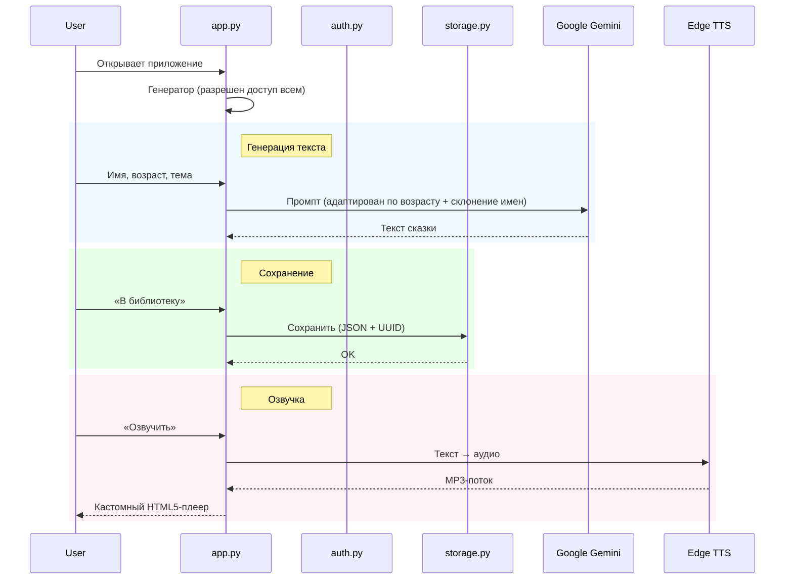

# Документация Архитектуры — Генератор Сказок

## Обзор Системы
**Генератор Сказок** — веб-приложение для генерации персонализированных сказок для детей. Использует Google Gemini для создания текста и Edge TTS для озвучки нейронными голосами.

## Технологический Стек
| Компонент | Технология |
|---|---|
| Frontend/Backend | [Streamlit](https://streamlit.io/) (Python 3.10+) |
| ИИ Ядро | [Google Gemini](https://ai.google.dev/) Flash/Pro |
| Синтез речи | [Edge TTS](https://github.com/rany2/edge-tts) |
| Аутентификация | [Supabase Auth](https://supabase.com/) |
| Аудио Плеер | Кастомный HTML5/CSS3/JS |
| Развёртывание | Локально / Streamlit Cloud / Docker |

## Структура Проекта
```
fairy_tale_generator/
├── app.py                # Точка входа: роутинг, генератор, плеер
├── auth.py               # Авторизация (Supabase)
├── config.py             # Централизованные константы и настройки
├── export.py             # Мультиформатный экспорт (TXT, PDF, EPUB, FB2)
├── i18n.py               # Интернационализация (переводы UI)
├── storage.py            # Уровень хранения (Local JSON / Будущий Supabase)
├── landing.py            # Лендинг-страница (Landing 3.0)
├── styles.py             # Глобальные CSS-стили
├── utils.py              # Утилиты (валюта, язык, форматирование)
├── requirements.txt      # Зависимости Python
├── .streamlit/
│   └── secrets.toml      # API-ключи (НЕ в git)
├── stories.json          # Локальная база данных сохраненных сказок
├── app.log              # Центральный лог-файл приложения
├── scripts/             # Служебные скрипты (smoke-тесты форматирования)
├── tests/               # Unit-тесты (pytest)
├── DEV_LOG.md            # Журнал разработки (обратная хронология)
├── README.md             # Документация проекта
├── ROADMAP.md            # План развития и тарифы
└── ARCHITECTURE.md       # Этот документ
```

## Поток Данных


```mermaid
sequenceDiagram
    participant User
    participant App as app.py
    participant Auth as auth.py
    participant Storage as storage.py
    participant Gemini as Google Gemini
    participant TTS as Edge TTS

    User->>App: Открывает приложение
    App->>App: Генератор (разрешен доступ всем)

    rect rgb(240, 248, 255)
        note right of App: Генерация текста
        User->>App: Имя, возраст, тема
        App->>Gemini: Промпт (адаптирован по возрасту + склонение имен)
        Gemini-->>App: Текст сказки
    end

    rect rgb(230, 255, 230)
        note right of App: Сохранение
        User->>App: «В библиотеку»
        App->>Storage: Сохранить (JSON + UUID)
        Storage-->>App: OK
    end

    rect rgb(255, 240, 245)
        note right of App: Озвучка
        User->>App: «Озвучить»
        App->>TTS: Текст → аудио
        TTS-->>App: MP3-поток
        App-->>User: Кастомный HTML5-плеер
    end
```

## Ключевые Компоненты

### 1. `app.py` (Оркестратор)
Главный файл (~1050 строк). Управляет всем жизненным циклом:
- **Роутинг**: Разделение через авторизацию. Анонимным пользователям показывается современный лендинг (Лендинг 3.0), авторизованным — полнофункциональный интерфейс генератора сказок.
- **Генерация**: Cascade-модель — перебор Gemini-моделей (`flash-lite` → `flash` → `flash-latest`).
- **Prompt Engineering**: Продвинутая адаптация под возраст (**6 групп: 0-12м, 1-3г, 4-7л, 8-12л, 13-17л, 18+**) и **контекстное склонение имен героев**.
- **Длительность сказки**: Ползунок выбора (1 мин ~150 слов, 5 мин ~700 слов, 15 мин ~2000 слов).
- **Озвучка**: Выбор голоса (мужской/женский) с preview.
- **Плеер**: `display_audio_player()` — HTML5/JS компонент с поддержкой скорости, повтора и скачивания.
- **Локальная библиотека**: Сохранение, просмотр и удаление сказок (JSON-based, будущая миграция на Supabase).
- **Интеграция**: Связывает `auth.py`, `storage.py` и `styles.py`.
- **Логирование**: Всё записывается в `app.log` для дебага (модель, ошибки, статусы генерации).

### 2. `auth.py` (Безопасность)
Обёртка над Supabase Client:
- `sign_up()`, `sign_in()`, `sign_out()`, `is_authenticated()`
- Безопасный импорт: `_SUPABASE_AVAILABLE` — приложение работает и без Supabase.
- Хранение сессии в `st.session_state`.

### 3. `landing.py` (Маркетинг - Landing 3.0)
Осoбая структура "Landing 3.0", совмещающая Streamlit и кастомный CSS/JS для "Wow-эффекта".
- Hybrid Rendering: HTML/CSS для визуалов + Streamlit для интерактива.
- Glassmorphism, mesh-градиенты, scroll-анимации, parallax bg-компоненты.
- Инкапсулированные стили через `inject_landing_styles()`
- Секции: Hero, Pricing, FAQ, Feature Showcase, Auth-формы.

### 4. `styles.py` (Глобальный Дизайн)
CSS-стили для интерфейса генератора (~1660 строк):
- **Premium UI**: Glassmorphism inputs, анимированные градиентные кнопки (Gradient Shift), кастомные Selectbox и Sliders.
- **Clean UI**: Полное скрытие стандартных элементов Streamlit (Footer, MainMenu, Toolbar) для эффекта «нативного» приложения.
- **Sidebar Toggle**: Кастомная, стилизованная кнопка управления боковой панелью.
- **Темы**: Полная поддержка Light/Dark режимов (`DARK_THEME`, `LIGHT_THEME` словари).
- **Анимации**: Hover-эффекты, Pulse, Glow для интерактивных элементов.
- **Toolbar-панель**: Glassmorphism-контейнер для кнопок действий (`toolbar_download`, `toolbar_voice`, `toolbar_save`) с вертикальными разделителями и hover-glow. CSS-специфичность override `(0,3,3)` перебивает глобальный secondary-стиль.
- **RTL-поддержка**: `get_rtl_styles()` — стили для арабского языка (справа-налево).
- **Dropdown Fix**: JavaScript-фикс для корректного закрытия selectbox при повторном клике.
- `get_app_styles(dark_mode)` — основная функция генерации CSS (f-string с условными значениями).
- `get_dropdown_fix_js()` — JavaScript для исправления поведения dropdown в формах.

### 5. `utils.py` (Утилиты)
- `get_user_currency()` — определение валюты по IP (ipapi.co)
- `get_user_language()` — определение языка пользователя (Accept-Language → IP → дефолт)
- `format_price()` — форматирование с разделителями тысяч
- Поддержка валют: RUB, USD, EUR, KZT, BYN, UZS
- Поддержка языков: ru, en

### 6. `i18n.py` & `legal_i18n.py` (Интернационализация)
Система переводов для многоязычного интерфейса и документов:
- **TRANSLATIONS**: Словарь в `i18n.py` для 8 языков UI (~3.5 млрд носителей).
- **LEGAL_TRANSLATIONS**: Словарь в `legal_i18n.py` с полными текстами «Политики конфиденциальности» и «Условий использования».
- **STORY_PROMPTS**: Промпты для генерации сказок на всех поддерживаемых языках.
- **t(key, lang)**: Функция получения перевода по ключу.
- **routing**: Параметр `lang` в URL синхронизируется с `st.session_state` и сохраняется при переходах между лендингом и документами.

### 7. `storage.py` (Уровень данных)
Инкапсулирует логику работы с сохраненными историями:
- **Local Persistence**: Чтение/запись в `stories.json`.
- **CRUD**: Функции `save_story`, `load_stories`, `delete_story`.
- **Sort**: Автоматическая сортировка по дате создания (новые сверху).
- **ID**: Генерация UUID для каждой сохраненной записи.

### 8. `export.py` (Мультиформатный Экспорт)
Модуль генерации файлов сказок для электронных книг и устройств:
- **TXT** — простой текст UTF-8, универсальный формат
- **PDF** — через `fpdf2`, с поддержкой Unicode/кириллицы (Arial Windows / DejaVu Linux)
- **EPUB** — через `ebooklib`, EPUB3 с CSS-стилями; поддерживается Kindle, Kobo, PocketBook, Apple Books
- **FB2** — FictionBook2 через `xml.etree.ElementTree` (без внешних зависимостей); популярен в СНГ
- **Архитектура**: каждый генератор — чистая функция `(title, body, lang) → bytes`
- **Кэширование**: файлы кэшируются в `st.session_state`, сбрасываются при новой генерации
- **`EXPORT_FORMATS`**: публичный словарь форматов с метаданными (MIME, расширение, help-текст)
- **`get_export_data(fmt, title, body, lang)`**: безопасная обёртка с логированием ошибок

### 9. `config.py` (Конфигурация)
Централизованное хранение всех констант приложения:
- **GEMINI_MODEL_CASCADE**: Каскад моделей для генерации (flash-lite → flash-latest).
- **STORY_LENGTH_MAP**: Длительности сказок (1/3/5 мин → количество слов).
- **AGE_RANGES**: Возрастные группы (0-12м, 1-3г, 4-7л, 8-12л, 13-17л, 18+).
- **AVAILABLE_VOICES**: Доступные голоса TTS.
- **TTS_VOICES_BY_LANGUAGE**: Голоса TTS для каждого языка (ru, en).
- **SUPPORTED_LANGUAGES**: Поддерживаемые языки интерфейса.
- **NAME_PATTERN**: Regex для валидации имени ребёнка.
- **APP_VERSION, APP_YEAR**: Версия приложения.
- **Сетевые настройки**: timeout, URL для IP API.

### 9. Логирование и Тестирование
- **Логирование**: Python `logging` → `console` + `app.log`. Логируются: статусы API, ошибки генерации, переключения моделей и действия пользователей.
- **Скрипты**: `scripts/smoke_test_format.py` — быстрая проверка корректности форматирования JSON и строк.
- **Тесты**: 
  - `tests/test_utils.py` — утилиты (валюта, язык, форматирование)
  - `tests/test_config.py` — конфигурация и константы
  - `tests/test_storage.py` — хранение данных
  - `tests/test_i18n.py` — интернационализация
- **Запуск**: `pytest tests/ -v`

## Планируемые Изменения
Подробный план: см. [ROADMAP.md](ROADMAP.md)

### Адаптация по Возрасту (Prompt Engineering 3.0)
Система использует **6 возрастных групп** с уникальной адаптацией для каждой:

| Группа | Возраст | Сложность | Примеры тем |
|--------|---------|-----------|------------|
| **Младенцы** | 0-12 мес | Колыбельная, ритмичная, 50-100 слов | Звуки, сон, уют |
| **Кроватки** | 1-3 года | Игривая, сенсорная, 150 слов | Цвета, действия, друзья |
| **Дошкол.** | 4-7 лет | Волшебная, моратль, ~300 слов | Приключения, помощь, добро |
| **Школа** | 8-12 лет | Динамичная, диалоги, ~300+ слов | Загадки, команда, вызовы |
| **Подростки** | 13-17 лет | Современная, эмоциональная, ~300+ слов | Дружба, выбор, поиск себя |
| **Взрослые** | 18+ лет | Литературная, философская, ~300+ слов | Психология, ирония, смысл |

### Жанры (12 категорий)
Выбор жанра влияет на стиль и сюжет: Сказка, Приключение, Фантастика, Детектив, Фэнтези, Супергероика, Поучительная история, Колыбельная, Мистика, Киберпанк, Философская притча, Романтика.

### Тарификация (Фаза 4 - В планах)
- **🆓 Free**: 3 генерации/день, фиксированная длина 3 мин, 1 голос, локальная библиотека (JSON)
- **⭐ Pro (499₽/мес)**: ♾ генерации, до 10 мин, все голоса, до 3 профилей детей
- **👨‍👩‍👧‍👦 Family (799₽/мес)**: ♾ генерации, до 20 мин, все голоса + клон, до 5 профилей, AI-обложки

### Текущий Статус (Фаза 2-3)
- ✅ Free/Pro/Family структура определена
- ⏳ Авторизация и привязка тарифа (Фаза 4)
- ⏳ Rate-Limiting и счётчики (Фаза 4)
- ⏳ Миграция на Supabase (Фаза 3-4)

### Роутинг - Текущее Состояние
- **Лендинг** (`landing.py`): Landing 3.0. Основная точка входа.
- **Юридические документы** (`legal.py`): Локализованные страницы (?page=privacy, ?page=terms).
- **Генератор** (`app.py`): Полнофункциональный интерфейс создания сказок.
- **Логика перехода**: Параметры `page` и `lang` обрабатываются централизованно в начале `app.py` с сохранением состояния в `st.session_state` и очисткой URL через `st.rerun()`.
